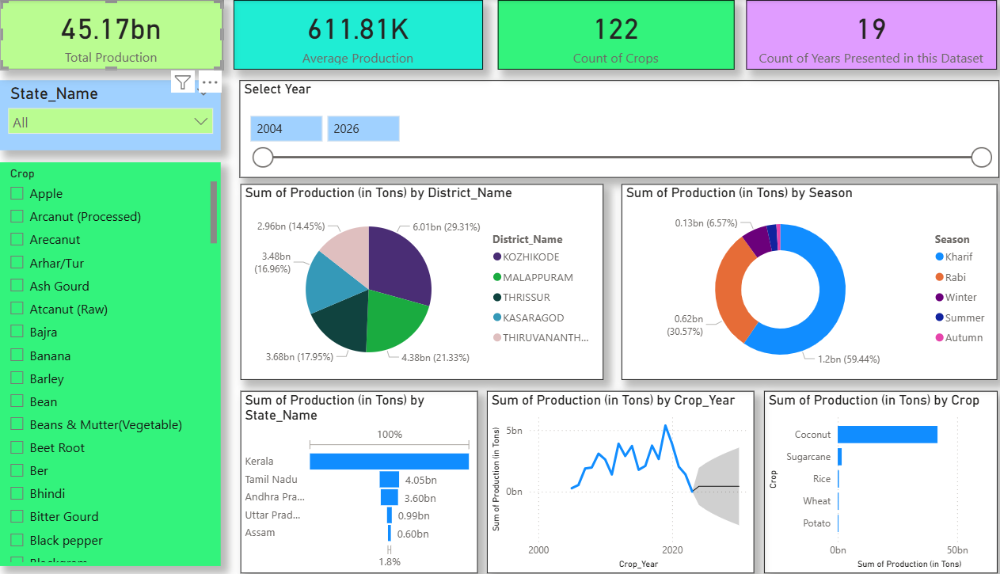

# 📊 Exhaustive Analysis of Indian Agriculture Sector (Power BI)

An interactive **Power BI Dashboard** that provides a comprehensive analysis of the **Indian Agriculture Sector**, covering crop production trends, regional performance, yield analysis, and key agricultural insights to support data-driven decision making.

---

## 🚜 Project Overview

This project leverages **Power BI** to visualize and analyze agricultural data from India.  
The dashboard helps stakeholders such as **policy makers, researchers, students, and agri-business analysts** understand patterns, trends, and regional variations in agriculture.
Agriculture is the backbone of the Indian economy. This project aims to analyze and visualize agricultural data using **Power BI** to uncover trends, patterns, and insights that can support **data-driven decision making**.
The dashboard allows users to interactively explore agricultural performance across **states, crops, years, and production metrics**, making complex datasets easy to understand through intuitive visuals.

---

## 🪟 Dashboard Preview

---

## 🎯 Objectives

- Analyze crop production trends across years  
- Compare state-wise and crop-wise performance  
- Identify high and low yield regions  
- Enable interactive exploration using filters and slicers  
- Present complex agricultural data in an intuitive visual format  

---

## 📊 Key Insights Provided

🌾 Crop-wise production analysis

🗺️ State-wise and region-wise comparison

📈 Year-over-year agricultural trends

📏 Yield and cultivated area impact on production

🔍 Interactive filtering for detailed exploration

---

## 🧰 Tools & Technologies Used

- **Power BI Desktop**
- **Microsoft Excel / CSV** (Data Source)
- **DAX** (Data Analysis Expressions)
- **Data Cleaning & Transformation (Power Query)**

---

## ▶️ How to Use the Project

- **Clone or download this repository**

- **Open the .pbix file using Power BI Desktop**

- **Refresh data if required**

- **Use slicers and visuals to explore insights interactively**

---

